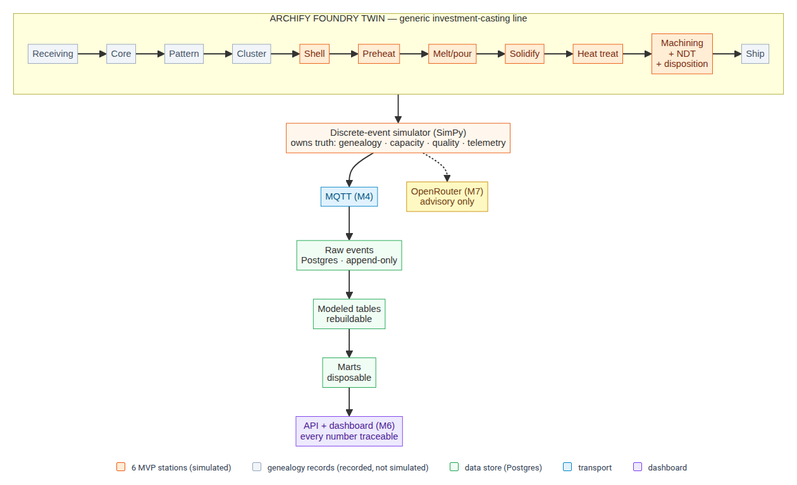

# Crucible

> Crucible is a research-grounded synthetic industrial-data platform. Its first reference model, **Archify Foundry Twin**, simulates a generic investment-casting line, preserves material genealogy, emits industrial-style events, and demonstrates quality and reliability decisions — without claiming access to real factory data.

[](https://github.com/duketopceo/crucible/actions/workflows/ci.yml)
[](https://www.python.org/)
[](LICENSE)
[](ROADMAP.md)

**Status:** Milestone 1 — research and factory specification. The deterministic simulation core (M2) is next.

## Why this exists

A portfolio demonstration of industrial IT, data-pipeline, and quality-systems competence: discrete-event simulation, ISA-95-aligned modeling, material genealogy and traceability, industrial transport (MQTT), provenance-preserving ingestion, and BI with full event-to-decision traceability.

The motivating context is turbine-blade investment casting (SpaceX is building a foundry), but the modeled factory is a **generic reference line**. No output represents SpaceX or any real foundry.

## Naming

- **Crucible** — the platform and Python package (`crucible`).
- **Archify Foundry Twin** — the first reference model built on it (`site_id: archify-reference-01`).

## Architecture



Source: `docs/archify-map.mmd`.

Three defining rules:

1. **Simulation code owns truth.** LLMs propose or explain; validators decide admissibility.
2. **Every number is traceable** to an event, model version, seed, parameter profile, and evidence status.
3. **Raw events are immutable; modeled tables are rebuildable** from raw events + versioned reference data.

## Quick start (M4+, not yet active)

```bash
cp .env.example .env
docker compose --profile core up
make simulate   # offline, fixed seed, no services required
```

## Navigation

- `ROADMAP.md` — the build plan: milestones, work orders, portfolio presentation.
- `REPO_INDEX.md` — start here; maps every directory and key file.
- `index/FILE_INDEX.yaml` — machine-readable per-file index (purpose, deps, break risk).
- `docs/` — technical research foundation, factory process, provenance, assumptions, work orders, QA/QC.
- `config/` — versioned factory model, recipes, defect model, reliability profiles.
- `src/crucible/` — the Python package (domain, simulation, events, provenance, adapters).
- `tests/` — unit, invariants, contract, integration, scenario.

## Honest claims policy

- **Verification** (did the code execute the defined model?) — yes, via invariant + golden-scenario tests.
- **Validation** (does the model match a real factory?) — **not claimed.** No real factory data exists here.
- **Uncertainty** — parameter profiles vary assumptions; metrics report sensitivity, not asserted truth.

## Screenshots

There is no running dashboard yet — analytics and the embedded dashboard land in M6. A screenshot of the incident walkthrough will be added here when it exists. Fabricating one now would violate this project's own honest-claims policy.

## License

MIT — see `LICENSE`.
